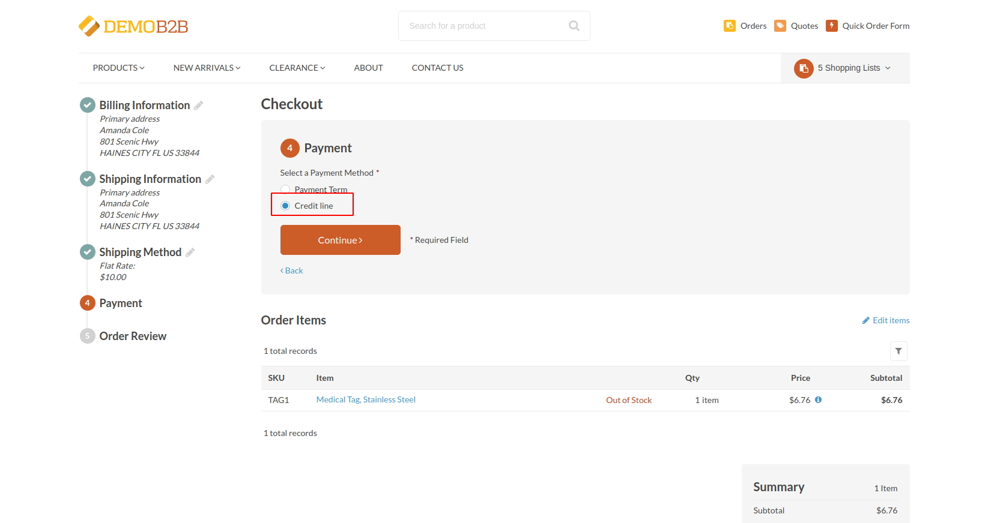

[](LICENCE)
[](https://github.com/synolia/OroCommerceCreditLinePlugin/actions/workflows/ci.yml)
[](https://packagist.org/packages/synolia/orocommerce-credit-line-plugin)
[](https://packagist.org/packages/synolia/orocommerce-credit-line-plugin)

# Oro Credit Line Bundle
This plugin allows you to have a credit line payment method integration, associated to the customer. 



## Features
- You can set a customer credit line amount that the customer users can use as a payment method - [Documentation](docs/CREDIT_LINE.md) 
- You will need to create the payment method with the credit line integration - [Documentation](docs/INTEGRATION.md)
- You can create your own credit line amount manager - [Documentation](docs/MANAGER.md)
- It has a no more credit message for the checkout - [Documentation](docs/NO_CREDIT.md)

## Requirements

| | Version |
| :--- | :--- |
| PHP  | 7.4, 8.0 |
| OroCommerce | 4.2 |

## Installation

1. Install the Plugin using Composer:
```shell
composer require synolia/orocommerce-credit-line-plugin
```
2. Run the Migrations
```shell
bin/console oro:migration:load --force
```
3. Clear Cache
```shell
bin/console cache:clear
```
4. Install & Build the Assets
```shell
bin/console oro:assets:install --symlink
```

## Contributing

* See [How to contribute](CONTRIBUTING.md)

## License

This library is under the [EUPL-1.2 license](LICENSE).

## Credits

Developed by [Synolia](https://synolia.com/).
