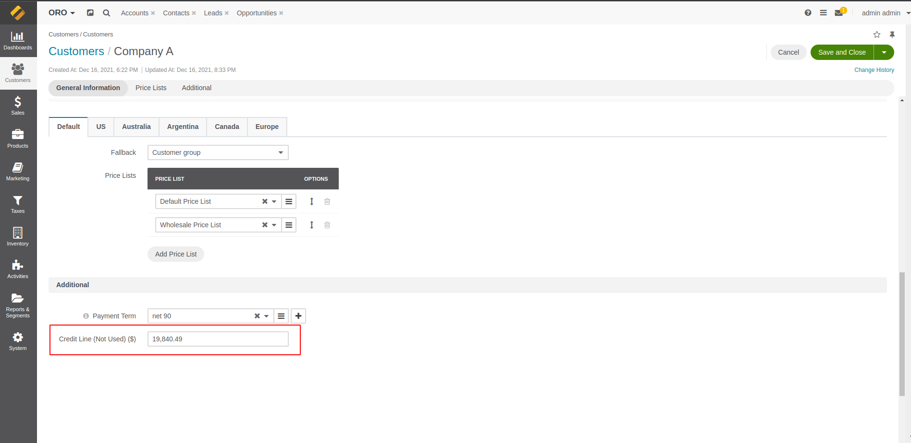

## Default implementaion for customer credit line

On the default implementation, you can set a customer credit line amount that the customer users can use as a
payment method. That amount will be decreasing with every order.

