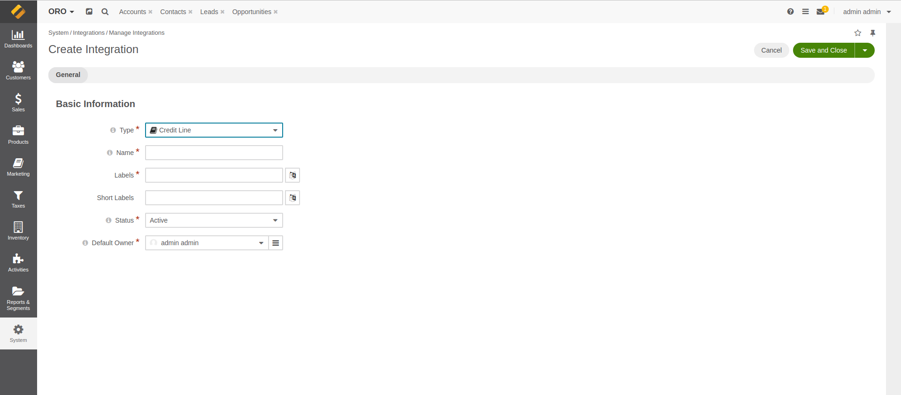
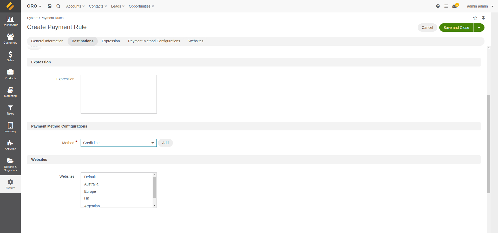

## Create the integration and the payment rule

To use this plugin you will need to create the integration with type 'Credit Line' and then add the payment rule, as
you'll normally do, selecting the newly created integration as the payment method configuration.

